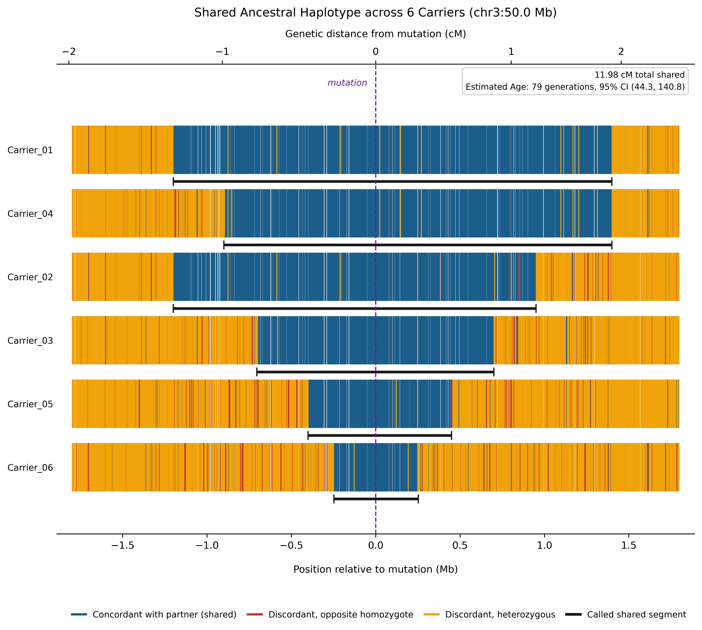

# DASH (Dating Ancestral Shared Haplotypes)

[](https://www.python.org/downloads/)
[](https://opensource.org/licenses/MIT)
[-brightgreen.svg)]()

Fast, robust, and dependency-free Python tool to **date shared ancestral founder mutations from unphased VCFs**. 

`dash.py` identifies shared ancestral haplotype segments among homozygous carriers of a recessive mutation, converts physical coordinates to genetic distance (cM), computes analytical mutation age estimates and confidence intervals, and generates figures of haplotype sharing across carriers. The tool runs out-of-the-box using only the Python standard library (with `matplotlib` needed only if generating figures with `--plot`).

<p align="center">
  
</p>

---

## Table of Contents

- [Overview & Rationale](#overview--rationale)
- [Key Features](#key-features)
- [Installation & Requirements](#installation--requirements)
- [Quick Start](#quick-start)
- [Plots & Visualization (`--plot`)](#plots--visualization---plot)
- [Methodology](#methodology)
  - [Homozygosity-Based Segment Calling](#homozygosity-based-segment-calling)
  - [Pairwise Ancestral Segment Calling](#pairwise-ancestral-segment-calling)
  - [Age Estimation Analytical Model](#age-estimation-analytical-model)
- [Command-Line Reference](#command-line-reference)
  - [Core Input & Mutation Parameters](#core-input--mutation-parameters)
  - [Quality Control & Genotype Filtering](#quality-control--genotype-filtering)
  - [Segment Calling & Error Tolerance](#segment-calling--error-tolerance)
  - [Genetic Map & Age Estimation Options](#genetic-map--age-estimation-options)
  - [Figure & Plotting Options](#figure--plotting-options)
  - [Output Controls](#output-controls)
- [Output Formats](#output-formats)
- [Recommended Workflow & Best Practices](#recommended-workflow--best-practices)
- [Citation & References](#citation--references)
- [License](#license)

---

## Overview & Rationale

When unrelated or distantly related individuals inherit a common ancestral mutation from a shared founder, the mutation resides on an ancestral chromosome segment preserved through generations. The length of this conserved ancestral haplotype shrinks over time due to meiotic recombination. By measuring the length of these shared segments (in centiMorgans, cM), we can estimate the time since the mutation arose.

### Why Unphased Data Works for Homozygous Recessive Mutations
Statistical phasing in rare disease cohorts can be challenging due to small sample sizes. However, for individuals who are **homozygous for the same recessive mutation**, phasing is **not required**. Because both homologous chromosomes carry the founder allele, ancestral segments are directly defined by continuous runs of **identical homozygous markers** flanking the mutation. Any discordant marker (a heterozygous call or an opposite homozygote) signals the termination of ancestral sharing.

`dash.py` automates the extraction of these ancestral tracts directly from multi-sample unphased VCFs, handles technical sequencing artefacts and missing calls, and computes age estimates without requiring R or external dependencies.

---

## Key Features

- **Zero Core Dependencies**: Core segment calling and age estimation use strictly the Python 3 standard library (`math`, `bisect`, `gzip`, `argparse`, etc.).
- **High-Quality Figures (`--plot`)**: Direct rendering of carrier haplotype tracks, individual marker concordance ticks, called segment bars, dual Mb/cM coordinate axes, and in-figure age estimate summaries.
- **Direct Unphased VCF Support**: Reads plain or bgzipped/gzipped multi-sample VCFs (`.vcf`, `.vcf.gz`, or standard input `-`).
- **Integrated Mutation Age Estimation**: Computes exact point estimates and confidence intervals based on ([Gandolfo, Bahlo & Speed 2014](https://doi.org/10.1534/genetics.114.164616)). 
- **Robust QC & Artefact Filtering**:
  - In-process BED accessibility mask filtering (`--mask`, e.g., 1000G / HGDP strict accessibility masks).
  - Depth-aware binomial allele balance test (`--het-ab-alpha`) to neutralize false heterozygous calls from paralogous or repetitive mapping errors.
  - Genotype quality (`--min-gq`) and depth (`--min-dp`) thresholding.
  - MNP and mismatch clustering tolerance (`--merge-mismatch-bp`).
- **Genetic Map Interpolation**: Linear cM interpolation supporting HapMap/1000 Genomes, PLINK (`.map`), and standard two-column formats.

---

## Installation & Requirements

### Requirements
- **Python 3.8+** (Standard Library only for core analysis)
- **matplotlib** & **numpy** (Optional; required only if generating figures via `--plot`)

### Installation
Clone the repository and make the script executable:

```bash
git clone https://github.com/malmarri/DASH.git
cd DASH
chmod +x dash.py
```

To enable the plotting feature:
```bash
pip install --user matplotlib numpy
```

---

## Quick Start

### End-to-End Pipeline (Segments + Genetic Map + Age Estimate + Plot)
Given an unphased VCF and a genetic map, run the complete pipeline and generate high-resolution figures:

```bash
./dash.py \
    --vcf cohort_chr22.vcf.gz \
    --chrom chr22 \
    --pos 2447992 \
    --samples-file carriers.txt \
    --genetic-map chr22.GRCh38.map \
    --map-format plink \
    --min-gq 20 \
    --min-dp 10 \
    --break-run 2 \
    --merge-mismatch-bp 100 \
    --plot \
    -o ancestral_segments.txt \
    --report qc_report.tsv
```

*This generates `ancestral_segments.txt`, cM CSVs, `qc_report.tsv`, and haplotype figures in both vector (`.pdf`) and raster (`.png`) formats.*

---

### Homozygosity-Based Segment Calling
1. For homozygous carriers of the same mutation, the script identifies all informative markers flanking the mutation.
2. It walks outwards along both the left (upstream) and right (downstream) chromosome arms.
3. At each marker:
   - **Concordant**: Both individuals are homozygous for the identical allele (e.g., both `0/0` or both `1/1`).
   - **Discordant**: A heterozygous call in either carrier (`0/1`) or opposite homozygotes (`0/0` vs `1/1`).
   - **Missing / Neutral**: Calls with missing genotypes or flagged by `--min-gq`, `--min-dp`, or `--het-ab-alpha` are skipped neutrally by default.

### Pairwise Ancestral Segment Calling
The script evaluates continuous sharing across all carrier pairs outwards from the mutation:
- For every pair of carriers, walk outwards from the mutation. A marker is concordant if **both** individuals are homozygous for the same allele.
- The pairwise walk stops at the first run of `--break-run` consecutive discordant markers (or `--max-mismatch`).
- Each individual's segment is then defined as the furthest coordinate (left and right independently) at which they still share with at least `--min-partners` (default: 1) other carrier(s).

### Age Estimation Analytical Model

The age estimation implements the analytical framework described in **Gandolfo, Bahlo & Speed (2014)**:

- **Segment Genetic Length**: For each carrier $i$, the total shared ancestral genetic length is $L_i = L_{i,\text{left}} + L_{i,\text{right}}$ (expressed in Morgans, where $1\text{ Morgan} = 100\text{ cM}$).

- **Independent Genealogy Model**:
  Assumes each carrier's lineage coalesced independently from the ancestral founder mutation. 

  Confidence intervals are calculated using the exact Gamma distribution quantiles.

- **Correlated Genealogy Model**:
  Accounts for lineage correlations (cryptic relatedness or shared genealogical branches) by adjusting the effective sample size based on the sample variance of segment lengths:

- **Chance-Sharing Correction**:
  Adjusts segment lengths for background identity-by-state (IBS) sharing by chance based on chromosome genetic length, marker density, and median population allele frequency.

---

## Plots & Visualization (`--plot`)

When `--plot` is specified, `dash.py` generates a high-quality visualization illustrating the haplotype sharing structure across carriers (see example above).

### Design & Visual Elements

- **Per-Carrier Haplotype Tracks**:
  - Each carrier is plotted on its own horizontal lane, sorted from longest to shortest called ancestral segment.
  - Informative markers are drawn as high-density vertical tick marks along the chromosome window.
- **Marker Concordance Coloring**:
  - <span style="color:#1b5e8c;font-weight:bold;">Dark Blue (`#1b5e8c`)</span>: **Concordant** with comparison partner (shared ancestral allele).
  - <span style="color:#c0392b;font-weight:bold;">Red (`#c0392b`)</span>: **Discordant opposite homozygote** (`0/0` vs `1/1`).
  - <span style="color:#f0a30a;font-weight:bold;">Amber (`#f0a30a`)</span>: **Discordant heterozygous** (`0/1` in either carrier). Formatted for accessibility under red-green color blindness.
- **Called Segment Bars**:
  - Solid dark bars (<span style="color:#1a1a1a;font-weight:bold;">`#1a1a1a`</span>) with end caps are plotted directly underneath each carrier row, highlighting the exact called segment span.
- **Dual Coordinate Axes**:
  - **Bottom Axis**: Physical distance relative to the mutation in Megabases (Mb).
  - **Top Axis**: Genetic distance from the mutation in centiMorgans (cM), dynamically interpolated when `--genetic-map` is provided.
- **Mutation & Reference Markings**:
  - Vertical dashed violet line (<span style="color:#6a1b9a;font-weight:bold;">`#6a1b9a`</span>) marks the mutation position.
  - An inset summary box displays the total cM shared across carriers and the estimated age with confidence intervals.
- **Zero Result Drift**:
  - The figure is constructed directly from the in-memory results and concordance evaluation functions. It is guaranteed to be 100% mathematically consistent with the numerical output.

### Customizing Plots

```bash
# Export custom filenames / formats (PDF and high-DPI PNG)
./dash.py ... --plot figure1.pdf figure1.png --plot-dpi 600

# Set a custom viewing window half-width (e.g., +/- 2.5 Mb around mutation)
./dash.py ... --plot --plot-window-bp 2500000

# Use full sample names instead of shortened IDs
./dash.py ... --plot --plot-full-ids --plot-title "Founder Mutation at chr22:2.45Mb"
```
---
## Command-Line Reference

### Core Input & Mutation Parameters

| Option | Type | Description |
|---|---|---|
| `--vcf` | File | Input VCF file (plain text, `.gz`, `.bgz`, or `-` for stdin). Required. |
| `--chrom` | String | Chromosome name (e.g., `3` or `chr3`). Matches flexibly. Required. |
| `--pos` | Integer | Mutation start position in bp (1-based). Required. |
| `--mut-end` | Integer | Mutation end position if spanning multiple bases (default: `--pos`). |
| `--samples` | String | Comma- or space-separated list of carrier sample IDs. |
| `--samples-file`| File | Text file with one carrier sample ID per line. |
| `-o`, `--out` | File | Output filename for the 3-column segment table (default: `ancestral_segments.txt`). |

*Note: If neither `--samples` nor `--samples-file` is provided, carriers are automatically detected as all samples homozygous ALT (`1/1`) at `--pos`.*

---

### Quality Control & Genotype Filtering

| Option | Default | Description |
|---|---|---|
| `--mask` | None | 3-column BED file (`chrom`, `start0`, `end`) of accessible regions (e.g., 1000G / HGDP strict mask). Markers outside are dropped in-process. |
| `--min-gq` | `0.0` | Genotypes with `GQ` below this threshold are downgraded to missing (neutral). Unfilled genotypes without GQ are kept. |
| `--min-dp` | `0.0` | Genotypes with read depth `DP` below this are downgraded to missing. |
| `--het-ab-alpha` | `0.0` | Exact two-sided binomial test *p*-value threshold on heterozygous allele depth (`AD`). Hets departing significantly from 50:50 are downgraded to missing (neutral), catching paralog/mapping artefacts. Set `0` to disable. |
| `--min-maf` | `0.0` | Exclude markers with cohort minor allele frequency below this threshold. |
| `--max-missing` | `0.2` | Exclude markers where missing carrier genotypes exceed this fraction (default: 20%). |
| `--pass-only` | `False` | Keep only records with `FILTER == PASS` or `.`. |
| `--snps-only` | `True` | Restrict analysis to biallelic SNVs (enabled by default). |
| `--allow-indels`| `False` | Allow biallelic indels in addition to SNVs. |

---

### Segment Calling & Error Tolerance

| Option | Default | Description |
|---|---|---|
| `--break-run` | `2` | Number of consecutive discordant markers required to terminate a segment (default: `2`, tolerating isolated genotyping errors; set `1` for zero tolerance). |
| `--merge-mismatch-bp` | `0` | Merge discordant markers within *N* bp into a single mismatch event. Prevents multi-nucleotide polymorphisms (MNPs) or alignment clusters from prematurely truncating tracts. |
| `--max-mismatch` | `-1` | Maximum total discordant markers tolerated per arm (`-1` = unlimited). |
| `--min-partners` | `1` | Number of other carriers an individual must still share with for the segment to continue. |
| `--boundary` | `marker` | Coordinate reported: outermost shared marker (`marker`) or first discordant marker (`breakpoint`). |
| `--missing-breaks`| `False` | Treat missing genotypes as discordant rather than skipping them neutrally. |

---

### Genetic Map & Age Estimation Options

| Option | Default | Description |
|---|---|---|
| `--genetic-map` | None | Path to genetic map file for the chromosome. Automatically enables cM output and `--age-estimate`. |
| `--map-format` | `hapmap` | Genetic map layout: `hapmap` (HapMap/1000G), `plink` (PLINK `.map`), or `two-column` (`bp cM`). |
| `--cm-prefix` | None | Prefix for output cM CSV files (default: `--out` prefix). |
| `--age-estimate` | `True` | Compute mutation age estimates in generations with confidence intervals (active when `--genetic-map` is supplied; use `--no-age-estimate` to disable). |
| `--confidence` | `0.95` | Confidence level for age estimation intervals (default: `0.95` for 95% CI). |
| `--chance-sharing-maf` | None | Median population MAF for chance-sharing correction (e.g. from an external reference panel). Overrides cohort-computed MAF. |
| `--stats` | `False` | Print chromosome-wide chance-sharing metrics (median MAF and marker count). |

---

### Figure & Plotting Options

| Option | Default | Description |
|---|---|---|
| `--plot` | None | Generate figure of called haplotypes. Pass without values to write `<prefix>_haplotype_sharing.pdf` and `.png`, or supply specific file paths (e.g., `--plot fig.pdf fig.png`). Requires `matplotlib`. |
| `--plot-window-bp` | None | Half-width of the plotted window in bp (default: 1.35× the longest called arm, ensuring full segment visibility with context). |
| `--plot-title` | None | Custom figure title (default: `'Shared ancestral haplotype at <chrom>:<pos>'`). |
| `--plot-dpi` | `600` | Raster resolution for PNG/raster figures (ignored for PDF/SVG). |
| `--plot-full-ids` | `False` | Label rows using full sample IDs instead of shortening names before the first underscore. |

---

### Output Controls

| Option | Default | Description |
|---|---|---|
| `--report` | None | Generate a detailed per-individual QC summary TSV (specify file path, or pass without value for `stderr`). |

---

## Output Formats

### 1. Default Segment Table (`-o ancestral_segments.txt`)
Headerless, tab-delimited 3-column table:

```tsv
Sample_01	171044167	173884738
Sample_02	172015648	172578359
Sample_03	171044167	173699783
```

### 2. Genetic Distance CSVs (`*_left_arm_cM.csv`, `*_right_arm_cM.csv`)
Headerless, single-row CSV files containing left and right arm genetic lengths (in cM) for each individual:

```csv
3.106000,1.108100,3.106000,0.885000,1.108100,0.480600
```

### 3. Per-Individual QC Report (`--report report.tsv`)
Tab-separated report with extensive per-sample diagnostic information:

```tsv
id	start	end	length_bp	left_arm_bp	right_arm_bp	left_partner	right_partner	markers_scanned
Sample_01	171044167	173884738	2840572	1403825	1436746	Sample_03	Sample_05	271360
Sample_02	172015648	172578359	562712	432344	130367	Sample_05	Sample_01	271360
```

### 4. Haplotype Figure (`--plot`)
Generates vector (`.pdf` / `.svg`) and high-resolution raster (`.png`) figures showing per-carrier marker concordance ticks, segment boundary bars, dual Mb/cM axes, and in-figure age estimates.

### 5. Terminal Age Estimation Summary
When `--genetic-map` is provided, `dash.py` prints the age estimate and confidence intervals directly:

```text
Age estimate (95% CI):
    independent genealogy: 49.9 generations, CI (28.1, 89.3)
    correlated  genealogy: 59.0 generations, CI (14.8, 119.4)
```

---

## Recommended Workflow & Best Practices

1. **VCF Preparation**:
   - Joint-called VCFs is better, but if you only have high coverage single-sample VCFs, merge with `bcftools merge -m snps -0`.
   - *Note on `-0` fill*: In variant-only VCFs, uncalled positions are filled with `0/0`. Real calls carry `GQ`/`DP` metadata, whereas filled sites have missing format fields. `dash.py` keeps filled hom-ref sites while gating real calls with `--min-gq` and `--min-dp`.

2. **Panel & Mask Subsetting**:
   - Filtering markers (except the mutation of interest) against high-quality reference datasets (e.g. HGDP or 1000 Genomes at MAF > 1%) removes private or batch-specific sequencing artefacts that could cause false opposite homozygotes.
   - Use `--mask <strict_mask.bed>` to exclude poorly mappable or repetitive regions.

3. **Handling Closely-Spaced Mismatches**:
   - Sequencing artefacts and MNPs often appear as paired or clustered mismatches. Using `--break-run 2` and `--merge-mismatch-bp 100` prevents single alignment artefacts from prematurely terminating an otherwise autozygous segment.

4. **Interpreting Independent vs. Correlated Models**:
   - If carriers share recent genealogical ancestry, cryptic relatedness, or if boundary breakpoints are identical across multiple carriers, the **correlated genealogy** model provides a robust, conservative estimate.
   - If individuals are known to be completely unrelated, the **independent genealogy** model can be used.

---

## Citation & References

If you use `dash.py` in your research, please cite the underlying theoretical and estimation methodology:

- **Gandolfo LC, Bahlo M, Speed TP.** (2014). *Dating common ancestors of autosomal recessive disease mutations.* **Genetics**, 197(4):1315–1327. doi:[10.1534/genetics.114.164616](https://doi.org/10.1534/genetics.114.164616)

---

## License

This project is licensed under the [MIT License](LICENSE).
